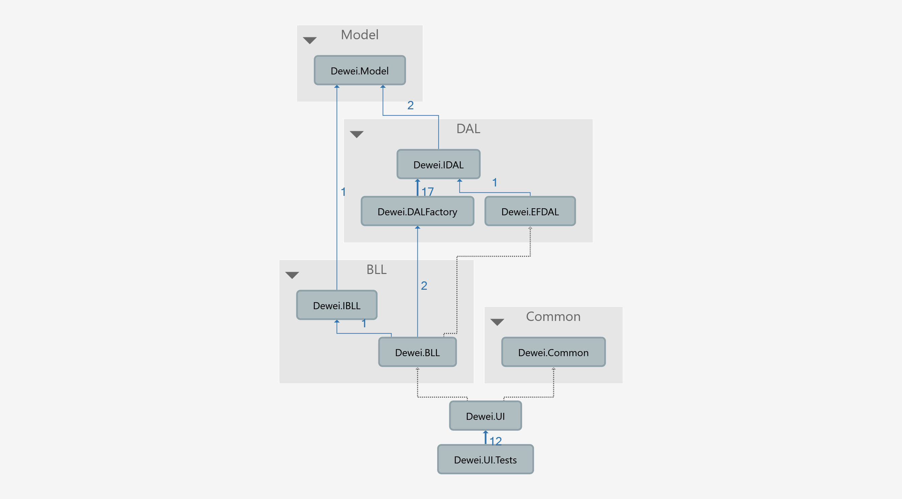
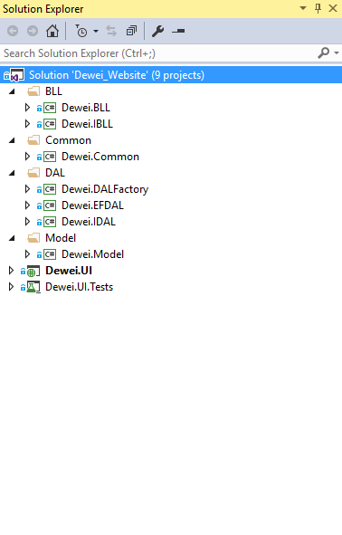

# C# Enterprise Application Project Structure

This is a highly scalable project structure, it enables you to customize your project in all direction. please leave a comment if you have any question related to this project, I'll try my best to answer you.
Technologies used include:
* .NET 4.6.1
* ASP.NET MVC5
* Spring framework 2 for DI
* Abstract Factory Design Pattern for DAL layer
* Entity Framework 6, Database first pattern
* Interface based programming
* Generic programming
* Any Database(MS SQL Server, Oracle and MySQL etc) or ORM which implements the IDAL is OK. For example, you can add NHibernate, Dapper and MyBatis.NET etc, just create another XXDAL implements IDAL, and change the DalAssemblyName at web.config
* Log4net to save the log
* T4 template engine to generate all the repeat similar logic code. For example, IUserDal, IPersonDal, IAccountDal, the basic code are the same.
* Git for continuous integration
* VS2015

## Project Dependency

## Visual Studio Screenshot

## TODO

* Implement session module, Save session into Redis or Memcached
* Integrate Spring AOP to monitor all the method call or permission check
* Write Unit Test to fully test all the main methods
* Implement a basic user information management function using Bootstrap etc.